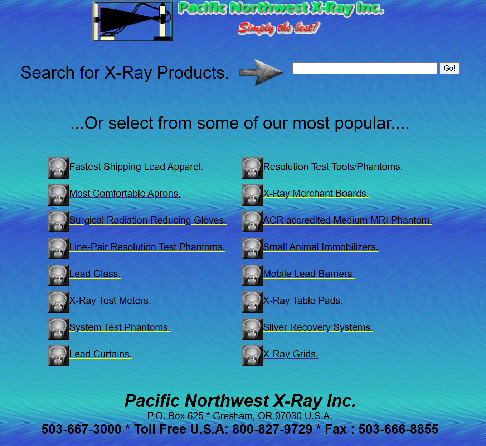

# Communication & UX

> **Summary:** In this project, I analyze and redesign a website with poor UX. I selected Pacific Northwest X-Ray Inc. because of its cluttered layout, inconsistent styling, and overwhelming link structure. My goal is to document the full UX process independently while strengthening my analytical, design, and documentation skills. This work will serve as both a learning experience and a potential portfolio case study.

## Task Overview

For this course, I identified a website with poor user experience (UX) and communication, then used it throughout the term to document my design and analysis process.

## Website Selection Process

I began by reviewing X-ray–related websites with weak UX and communication. After narrowing down my options to three - [Craigslist](https://www.craigslist.com), the [West Vancouver Recreation Center](https://westvancouver.ca/parks-recreation/facilities/west-vancouver-community-centre-aquatic-centre), and [Pacific Northwest X-Ray Inc.](https://www.pnwx.com/) - I evaluated each through discussion and analysis using ChatGPT. Ultimately, I selected **Pacific Northwest X-Ray Inc.** as my focus.

## Rationale for Selection

This website stood out for several UX issues. The design feels visually cluttered, with excessive colors and inconsistent styling that detract from the user experience.

The frequent use of yellow underlined links reduces emphasis on the most important content, making it difficult for users to prioritize information. Additionally, many links compete for attention across the interface. I believe condensing these into fewer, higher-priority options would significantly improve readability and user interaction.

[Explore the Pacific Northwest X-Ray Inc. website](https://www.pnwx.com/)

## Working Approach

I'm working alone on this project to maintain focus and strengthen my critical and analytical thinking skills.

## Course Goals

Through this class, I'm hoping to gain a comprehensive understanding of the UX documentation and design process, including hands-on work in Figma. I also want to improve my writing, critical thinking, and analytical skills. Looking ahead, I plan to redesign the website over the summer and either propose it to the owners or include it in my portfolio as a case study.

---

## What I Learned & How It Applies

Starting with site selection taught me that **choosing the right subject is itself a design decision**. By deliberately picking a website with layered, compounding UX problems - visual clutter, poor hierarchy, and an overwhelming link structure - I gave myself a richer surface to work against throughout the term.

More practically, comparing three candidate sites before committing forced me to articulate *why* something feels broken, not just that it does. For PNWX, the core issue is that every element competes for the same level of attention, so nothing stands out. That diagnosis became the anchor for every design decision I made in later weeks: if a change doesn't reduce competition for attention or make a priority clearer, it probably isn't worth making.
