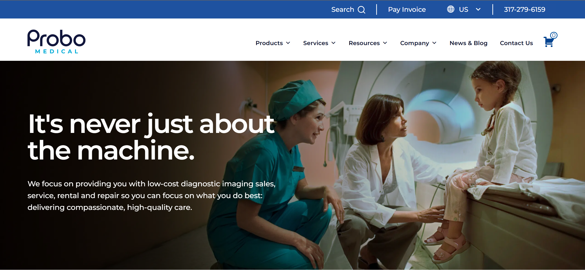
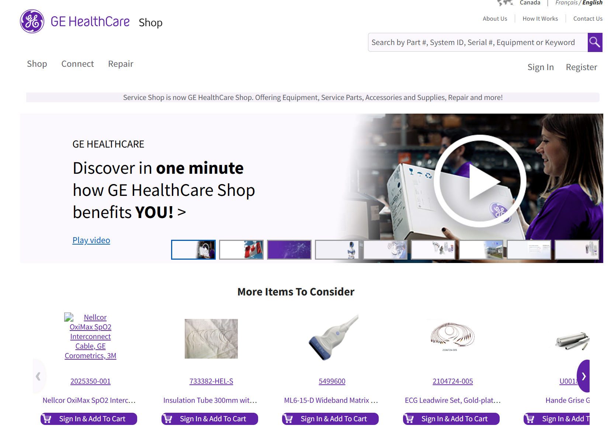

# What I Learned in ACIT 2811

> **Summary:** This week examined core usability principles, design thinking, project planning, and market research to strengthen the foundation of the term project. Emphasis was placed on usability, credibility, accessibility, and structured problem-solving through the five stages of design thinking. Reviewing competitor websites and defining a formal proposal helped align the project with real-world standards and identify opportunities for improvement.

## Seven Usability Factors

The seven usability factors play a key role in designing effective websites and products. They strongly influence how users interact with a system and perceive its quality.

The most important factors, in my view, are **usable**, **findable**, **credible**, and **accessible**, as they directly affect users' ability to complete tasks.

If a site isn't usable or content is hard to find, users become frustrated and leave. Credibility builds trust, especially when users share personal or payment information. Accessibility ensures inclusive and ethical design. Without these factors, even visually appealing websites can fail.

---

## Design Thinking

Design thinking is a user-centered approach focused on understanding users before proposing solutions. Although the process can feel abstract at first, it helps prevent jumping to conclusions without fully defining the problem.

The design thinking process includes five stages:

- **Empathize:** Understand users through observation and feedback
- **Define:** Clearly identify the core problem
- **Ideate:** Generate multiple solution ideas
- **Prototype:** Create simple versions of solutions
- **Test:** Gather feedback to improve the design

---

## Term Project Proposal

We were required to create a proposal outlining our goals for the term project. Our instructor will evaluate progress against this proposal, reflecting real-world expectations of accountability and performance.

This process emphasizes the importance of setting realistic goals and tracking progress, similar to professional project management.

---

## Market Research

As part of my market research, I reviewed existing websites related to my project to understand current design approaches.

One example is [ProboMedical](https://www.probomedical.com/). While the site appears modern, image quality and section consistency could be improved.

Another example is [GE Healthcare](https://shop.gehealthcare.ca/gehcstorefront/). Although similar in concept, the layout feels inconsistent and lacks clarity.

*Figure 1: ProboMedical homepage*

*Figure 2: GE Healthcare Shop homepage*
