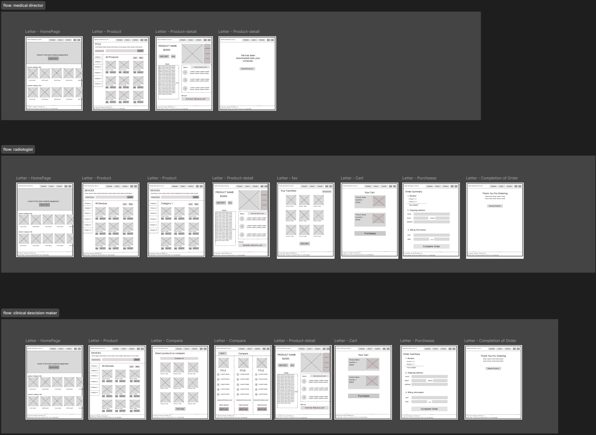

# User Flow & Low-Fidelity Wireframes

> **Summary:** This week, I worked on two major deliverables: user flows and low-fidelity wireframes. I built on the personas and user stories from Week 3 by mapping out how each user type moves through the site, then translated those paths into wireframe layouts using Figma. I focused on structure and navigation - not visual styling.

---

## From User Stories to User Flows

If you haven't read [Week 3](week3.md) yet, that's where I developed the personas and user stories that drive this work. Each user flow here maps directly to one of those three user stories.

Personally, creating the flows felt manageable because I already had a clear picture of how users would move through the site. My goal was to make those mental models visible and testable.

---

## Why I Skipped Paper Wireframes

Our instructor suggested starting on paper, but I found it hard to iterate quickly that way. Figma let me experiment with layouts faster and gave me a cleaner record to build on in future weeks.

---

## What the Wireframes Focus On

The layouts prioritize two things:

- **Simplified navigation** - fewer clicks to reach key content
- **Improved content hierarchy** - most important information appears first, so users can scan without scrolling far

Working at low fidelity kept me focused on structure and usability. I deliberately avoided styling decisions - those come later.

---

## What I Learned

Translating user stories into actual screen layouts makes abstract goals concrete. When I asked "where does this user go next?", the answer often revealed gaps in the original site's structure that text analysis alone had missed.
