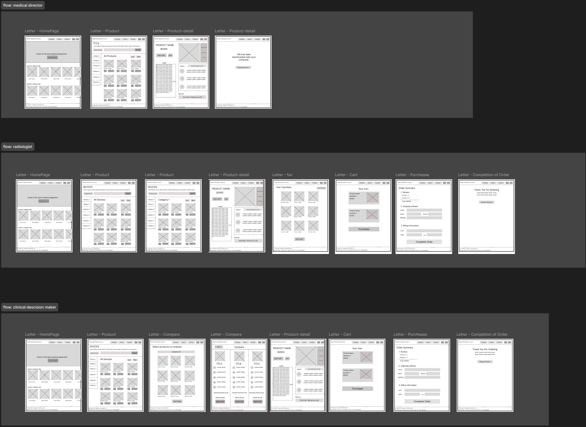

# User Flow & Low-Fidelity Wireframes

> **Summary:** This week, I worked on two major deliverables: user flows and low-fidelity wireframes. I built on the personas and user stories from Week 3 by mapping out how each user type moves through the site, then translated those paths into wireframe layouts using Figma. I focused on structure and navigation - not visual styling.

---

## From User Stories to User Flows

If you haven't read [Week 3](week3.md) yet, that's where I developed the personas and user stories that drive this work. Each user flow here maps directly to one of those three user stories.

Personally, creating the flows felt manageable because I already had a clear picture of how users would move through the site. My goal was to make those mental models visible and testable.

---

## Why I Skipped Paper Wireframes

Our instructor suggested starting on paper, but I found it hard to iterate quickly that way. Figma let me experiment with layouts faster and gave me a cleaner record to build on in future weeks.

---

## Wireframe Walkthrough

The low-fidelity wireframes cover three key screens: the homepage, a product category page, and an individual product detail page. Each screen is intentionally stripped of color, imagery, and typography - only layout zones, navigation placement, and content blocks are defined at this stage.

*Figure 1: Low-fidelity wireframes - left to right: homepage, product category, product detail*

**Homepage:** The header consolidates PNWX's current fragmented navigation into a single, clearly labelled top bar. A prominent search field sits above the fold so users who arrive with a specific product in mind don't need to browse at all. Below the fold, a simplified category grid replaces the current wall of text links.

**Product Category Page:** Filters are surfaced in a left-side panel rather than buried in a sub-menu. This reflects the Week 3 finding that both Dr. Sarah and Mike need to narrow results quickly - Dr. Sarah by specification, Mike by price range.

**Product Detail Page:** The layout prioritizes the product name, a short plain-language description, price, and a single prominent call-to-action button. Spec sheets and compliance documents appear below, accessible but not competing with the purchase flow.

---

## What the Wireframes Focus On

The layouts prioritize two things:

- **Simplified navigation** - fewer clicks to reach key content
- **Improved content hierarchy** - most important information appears first, so users can scan without scrolling far

Working at low fidelity kept me focused on structure and usability. I deliberately avoided styling decisions - those come later.

---

## What I Learned & How It Applies

Translating user stories into screen layouts exposed a specific structural problem in the original PNWX site: the product detail page buries the purchase action below a long block of technical copy. A user who isn't a technician - like Mike from the Week 3 personas - either gives up or calls for support, adding friction that a better layout would eliminate entirely.

The wireframe process also confirmed that the IA decisions from Week 4 were sound. The simplified category structure mapped cleanly onto the category page layout without forcing awkward label compromises. That consistency - from sitemap to wireframe to layout - is exactly what information architecture is supposed to produce, and seeing it work in practice made the value of that earlier groundwork clear.
